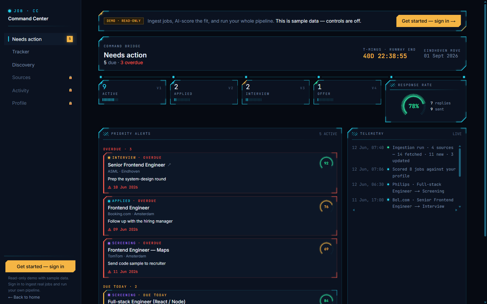
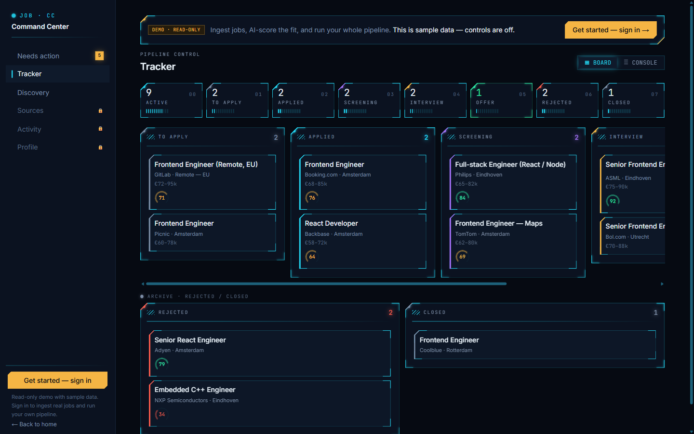
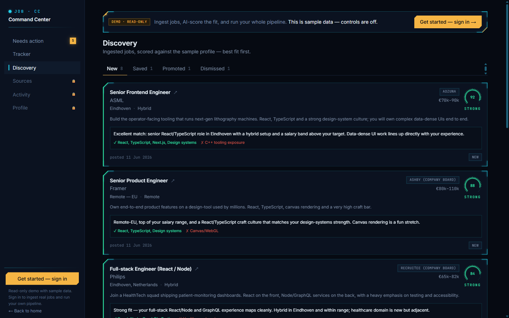

# Job Command Center

A personal job-discovery and application tracker that ingests roles from a dozen sources every morning, scores each one against your profile with AI, and ranks your inbox best-fit-first — so the only thing left to do is apply.

**[Live demo (no signup)](https://ignis-job-application.vercel.app/demo)** · **[App](https://ignis-job-application.vercel.app/)** · **[Source](https://github.com/MihailKirkov/ignis_job-application)**



## Why I built it

I built this because I was about to use it. I was job-hunting across the Netherlands with a hard deadline, and the actual bottleneck wasn't applying — it was the hours lost *finding* roles worth applying to: opening the same boards every day, re-reading listings, guessing which ones fit. So I automated that part.

Now it runs itself: every morning it pulls fresh roles from the sources I care about, an AI scores each one against my CV and target profile, and I open a ranked inbox of the best matches instead of a search bar. My friends are using it for their own searches. It's not a demo project — it's a tool that genuinely saves time, which is the only reason it exists.

## What it does

- **Automated daily ingestion.** A scheduled job runs every morning and pulls new roles from every source you've configured — no manual searching. Re-runs are idempotent, so you never see the same job twice.
- **Personalized AI fit-scoring.** Each job is scored 0–100 against your profile and CV — with a verdict (strong / medium / weak), the skills that matched, the gaps, and a one-line rationale. Your inbox is sorted best-fit-first, so the filtering is done for you.
- **Multi-source, no scraping.** Pulls from public job APIs (Adzuna, Arbeitnow, Remotive, RemoteOK) and public ATS company boards (Greenhouse, Lever, Ashby, Workable, Recruitee, SmartRecruiters) — official endpoints only, no ToS-violating scraping. Anything without an API can be imported on demand.
- **Discovery → pipeline in one click.** Save, dismiss, or promote a discovered job; promoting creates a pre-filled application linked back to the posting.
- **Application tracker.** A drag-and-drop pipeline board (with optimistic updates) and a dense console view, with fit scores, stage stats, search, and JSON export.
- **A "command bridge" homepage.** Pipeline vitals, response rate, a deadline countdown, priority follow-ups due today, and a live activity feed.
- **Full activity + ingestion logs.** Every status change, promotion, and ingestion run is recorded and browsable, with per-source fetched/new/updated breakdowns.




## How it works

The app has two surfaces — a discovery inbox and an application tracker — on top of Supabase (Postgres + Auth + Row-Level Security).

The deterministic core — normalizing each source into one shape, deduping, filtering, building and parsing the AI scoring prompts — is a set of **pure functions** kept free of React and the database. Every source fetcher and the model client take an injectable implementation, so the whole brain is unit-tested with canned data and **no network or DB**. Stateful work goes through Supabase: **Server Components** read, **Server Actions** (UI) and **Route Handlers** (APIs, cron) write, and a root proxy refreshes the session and gates protected routes.

Security is RLS-first: every table is owner-scoped (`auth.uid() = user_id`), so the browser key can only ever touch your own rows. The one exception is the scheduled cron, which has no session and uses a service-role client server-side only.

```
src/
  app/            App Router — pages (Server Components), route handlers, auth
  components/     server-safe primitives + client widgets (the HUD design system)
  lib/
    sources/      one fetcher per provider → a shared NormalizedJob shape
    discovery/    pure brain: normalize, dedupe, filter, ingest, import
    ai/           scoring prompt builder + parser (pure, tested)
    actions/      Server Actions — the write path
    supabase/     four clients, chosen by context
supabase/migrations/   schema + RLS + triggers (source of truth)
tests/                 Vitest unit tests for the pure logic
```

## Notable engineering decisions

- **Public APIs over scrapers.** Scraping LinkedIn/Indeed violates their terms, gets accounts banned, and breaks constantly. Building on official aggregator APIs and public ATS endpoints is more reliable *and* the right call — the limitation is deliberate.
- **Cost-aware AI.** Scoring runs on a per-user API key, batches multiple jobs per request, and uses prompt caching on the static profile prefix, so re-scoring a full inbox doesn't re-bill the profile context every time. Large runs are async and tracked in the DB, with live progress — the UI never blocks.
- **A testable seam everywhere it matters.** Fetchers and the model client accept an injected `fetch`/call implementation, which is what lets the source layer and the scorer be unit-tested deterministically without hitting any external service.
- **One log, two shapes.** A generic `activity_events` feed for human-meaningful events (applied, promoted, status changed) and structured `ingestion_runs` tables for operational metrics — bridged so the activity feed stays unified while the per-source data stays queryable.

## Tech stack

Next.js (App Router) · TypeScript · Tailwind · Supabase (Postgres / Auth / RLS) · `@supabase/ssr` · Anthropic API · Vitest · deployed on Vercel with Vercel Cron.

## Running locally

```bash
npm install
cp .env.example .env.local   # Supabase keys, Adzuna key, CRON_SECRET, Anthropic key
npm run dev
```

Full setup (Supabase project, migrations, auth config, deploy + cron) is in [`docs/setup.md`](docs/setup.md). Architecture, the testing approach, and the database design are documented in [`docs/`](docs/).

```bash
npm run typecheck && npm run lint && npm test && npm run build
```