# Database

Postgres on Supabase. **Fourteen application tables**, all owned by a Supabase Auth
user and protected by Row-Level Security. The source of truth is the migrations under
`supabase/migrations/`:

| Migration | Adds |
| --------- | ---- |
| `0001_init.sql` | the original four: `jobs`, `applications`, `sources`, `saved_filters` (+ the `set_updated_at` trigger). |
| `0002_profiles.sql` | `profiles` + the private `cvs` Storage bucket. |
| `0003_ai_scoring.sql` | the `jobs.fit_*` columns + `user_secrets` (encrypted API key). |
| `0004_activity_ingestion.sql` | `activity_events` + `ingestion_runs` + `ingestion_run_sources`. |
| `0005_scoring_runs.sql` | `scoring_runs` (async fit-scoring runs). |
| `0006_companies_contacts.sql` | `companies` + `contacts` (the network layer) + `applications.company_id`; widens the `activity_events.category` vocabulary. |
| `0007_outreach.sql` | `outreach` (the touch log) + widens the `activity_events.category` vocabulary again. |
| `0008_attribution_indexes.sql` | `(user_id, channel, status)` indexes on `applications` + `outreach` for the channel funnel (no new columns). |
| `0009_message_templates.sql` | `message_templates` (reusable outreach boilerplate with `{variable}` slots). |

The TypeScript mirror is `src/types/database.ts`. This doc explains the shape and
the *why*. See also [`ai-scoring.md`](./ai-scoring.md) (the fit columns +
`scoring_runs` + `user_secrets`) and [`logging.md`](./logging.md) (`activity_events`
+ the ingestion tables).

---

## ER diagram

```mermaid
erDiagram
    USERS ||--o| PROFILES      : has
    USERS ||--o| USER_SECRETS  : has
    USERS ||--o{ APPLICATIONS  : owns
    USERS ||--o{ JOBS          : owns
    USERS ||--o{ SOURCES       : owns
    USERS ||--o{ SAVED_FILTERS : owns
    USERS ||--o{ ACTIVITY_EVENTS       : owns
    USERS ||--o{ INGESTION_RUNS        : owns
    USERS ||--o{ INGESTION_RUN_SOURCES : owns
    USERS ||--o{ SCORING_RUNS          : owns
    USERS ||--o{ COMPANIES             : owns
    USERS ||--o{ CONTACTS              : owns
    USERS ||--o{ OUTREACH              : owns
    USERS ||--o{ MESSAGE_TEMPLATES     : owns
    JOBS  ||--o{ APPLICATIONS  : "promoted into"
    COMPANIES ||--o{ CONTACTS     : "employs"
    COMPANIES ||--o{ APPLICATIONS : "linked to"
    COMPANIES ||--o{ OUTREACH     : "addressed to"
    CONTACTS  ||--o{ OUTREACH     : "sent to"
    APPLICATIONS ||--o{ OUTREACH  : "about"
    INGESTION_RUNS ||--o{ INGESTION_RUN_SOURCES : "breaks down into"
    SOURCES ||--o{ INGESTION_RUN_SOURCES : "attributed to"

    USERS {
        uuid id PK "auth.users (managed by Supabase Auth)"
        text email
    }

    JOBS {
        uuid    id PK
        uuid    user_id FK "-> auth.users.id, on delete cascade"
        text    source "adzuna | arbeitnow | ... | import"
        text    external_id "source-native id"
        text    title
        text    company
        text    location
        text    mode "On-site | Hybrid | Remote | null"
        numeric salary_min
        numeric salary_max
        text    currency
        text    url
        text    description
        timestamptz posted_at
        jsonb   raw "untouched source payload"
        text    fuzzy_key "normalized company+title+location"
        text    state "new | saved | dismissed | promoted"
        numeric fit_score "AI fit 0-100 (null until scored)"
        text    fit_verdict "strong | medium | weak | null"
        text    fit_summary
        jsonb   fit_breakdown "{ matched_skills, gaps }"
        timestamptz scored_at
        text    scored_profile_hash "hash of scoring-relevant profile fields"
        timestamptz ingested_at
        timestamptz created_at
        timestamptz updated_at
    }

    APPLICATIONS {
        uuid id PK
        uuid user_id FK "-> auth.users.id, on delete cascade"
        uuid job_id FK "-> jobs.id, nullable, on delete set null"
        uuid company_id FK "-> companies.id, nullable, on delete set null"
        text company
        text role
        text location
        text mode "On-site | Hybrid | Remote"
        text channel "Detachering | Brainport portal | LinkedIn | ..."
        text status "To apply | Applied | Screening | Interview | Offer | Rejected | Closed"
        text salary "free text, e.g. EUR 60-70k"
        text link
        text contact
        date date_applied
        text next_action
        date next_action_date
        text notes
        timestamptz created_at
        timestamptz updated_at
    }

    SOURCES {
        uuid id PK
        uuid user_id FK "-> auth.users.id, on delete cascade"
        text type "adzuna | greenhouse | lever | ..."
        jsonb config "query/where/token/etc."
        boolean enabled
        timestamptz last_run_at
        timestamptz created_at
        timestamptz updated_at
    }

    SAVED_FILTERS {
        uuid id PK
        uuid user_id FK "-> auth.users.id, on delete cascade"
        text name
        jsonb criteria "serialized FilterCriteria params"
        timestamptz created_at
        timestamptz updated_at
    }

    PROFILES {
        uuid    user_id PK "-> auth.users.id, on delete cascade (one row per user)"
        text    full_name
        text    headline
        text    location
        text    summary
        text    seniority "intern | junior | medior | senior | lead | principal | null"
        text_   skills "text[]"
        text_   target_roles "text[]"
        text_   target_locations "text[]"
        numeric target_salary_min
        text_   work_modes "text[], subset of On-site | Hybrid | Remote"
        text_   languages "text[]"
        jsonb   links "[{ label, url }]"
        text    cv_text "extracted/pasted plain text"
        text    cv_file_path "path in the private 'cvs' Storage bucket"
        timestamptz created_at
        timestamptz updated_at
    }

    USER_SECRETS {
        uuid    user_id PK "-> auth.users.id, on delete cascade (one row per user)"
        text    anthropic_api_key "aes-256-gcm ciphertext (never selected client-side)"
        timestamptz created_at
        timestamptz updated_at
    }

    ACTIVITY_EVENTS {
        uuid id PK
        uuid user_id FK "-> auth.users.id, on delete cascade"
        text type "application.status_changed | job.promoted | ..."
        text category "application | job | profile | source | ingestion"
        text entity_type "application | job | profile | source | ingestion_run"
        uuid entity_id "nullable, NO FK (log outlives the entity)"
        text summary "precomputed human line"
        jsonb meta
        timestamptz created_at
    }

    INGESTION_RUNS {
        uuid id PK
        uuid user_id FK "-> auth.users.id, on delete cascade"
        text trigger "manual_all | manual_source | cron"
        text status "ok | partial | error"
        integer sources_run
        integer jobs_fetched
        integer jobs_new
        integer jobs_updated
        timestamptz started_at
        timestamptz finished_at
        integer duration_ms
        timestamptz created_at
    }

    INGESTION_RUN_SOURCES {
        uuid id PK
        uuid run_id FK "-> ingestion_runs.id, on delete cascade"
        uuid user_id FK "-> auth.users.id (denormalized for RLS)"
        uuid source_id FK "-> sources.id, nullable, on delete set null"
        text source_type
        text source_label
        text status "ok | error | skipped"
        integer http_status
        integer jobs_fetched
        integer jobs_new
        integer jobs_updated
        integer duration_ms
        text message "secrets REDACTED before storing"
        timestamptz created_at
    }

    SCORING_RUNS {
        uuid id PK
        uuid user_id FK "-> auth.users.id, on delete cascade"
        text trigger "manual | cron"
        text status "queued | running | done | error | cancelled"
        integer total
        integer completed
        integer failed
        timestamptz started_at
        timestamptz finished_at
        text error
        timestamptz created_at
    }

    COMPANIES {
        uuid id PK
        uuid user_id FK "-> auth.users.id, on delete cascade"
        text name "unique per user on lower(name)"
        text website
        text location
        text ats_type
        text notes
        timestamptz created_at
        timestamptz updated_at
    }

    CONTACTS {
        uuid id PK
        uuid user_id FK "-> auth.users.id, on delete cascade"
        uuid company_id FK "-> companies.id, nullable, on delete set null"
        text name
        text role
        text email
        text linkedin_url
        text channel "Detachering | LinkedIn | Referral | ... | null"
        text notes
        timestamptz last_contacted_at
        date next_follow_up_at
        timestamptz created_at
        timestamptz updated_at
    }

    OUTREACH {
        uuid id PK
        uuid user_id FK "-> auth.users.id, on delete cascade"
        uuid contact_id FK "-> contacts.id, nullable, on delete set null"
        uuid company_id FK "-> companies.id, nullable, on delete set null"
        uuid application_id FK "-> applications.id, nullable, on delete set null"
        text channel "Detachering | LinkedIn | ... | null"
        text status "Sent | Replied | No reply | Bounced"
        text subject
        text body
        timestamptz sent_at
        date next_bump_at
        text notes
        timestamptz created_at
        timestamptz updated_at
    }

    MESSAGE_TEMPLATES {
        uuid id PK
        uuid user_id FK "-> auth.users.id, on delete cascade"
        text name
        text kind "detachering_dm | open_app_email | follow_up | recruiter_dm | other"
        text subject
        text body "{company}/{role}/{contact}/{stack}/{name} slots"
        timestamptz created_at
        timestamptz updated_at
    }
```



> `USERS` is Supabase's built-in `auth.users` table — we don't define it, we only
> reference it. Every app table carries a `user_id` FK to it with
> `on delete cascade`, so deleting an account removes all of its data.

---

## Relationships & lifecycle

- **Ownership (all 14):** `applications`, `jobs`, `sources`, `saved_filters`,
  `profiles`, `user_secrets`, `activity_events`, `ingestion_runs`,
  `ingestion_run_sources`, `scoring_runs`, `companies`, `contacts`, `outreach`, and
  `message_templates` each belong to a user via `user_id`. This is what RLS keys on. `profiles` and
  `user_secrets` are the **1:1** tables — `user_id` is their primary key, so there is
  at most one row per user.
- **Network layer (`companies` → `contacts` / `applications`):** a contact and an
  application each carry a **nullable** `company_id` FK to `companies.id` with
  `on delete set null`, so deleting a company never deletes the people or
  applications built around it — they just unlink. Companies are deduped per user by
  a unique index on `lower(name)`, which is the idempotency anchor for
  "auto-create-or-link a company by name" when a contact is saved.
- **Outreach (`outreach` → `contacts` / `companies` / `applications`):** each touch
  carries **three nullable** FKs (`contact_id`, `company_id`, `application_id`), all
  `on delete set null`, so the touch log outlives any entity it referenced. Logging a
  touch stamps the linked contact's `last_contacted_at`; its `next_bump_at` feeds the
  follow-up queue alongside contact follow-ups and application next-actions.
- **Message templates (`message_templates`):** standalone, user-scoped reusable
  outreach boilerplate — no FKs beyond `user_id`. The `body`/`subject` carry
  `{company}/{role}/{contact}/{stack}/{name}` slots filled when composing a draft.
  `kind` is `check`-constrained to `detachering_dm | open_app_email | follow_up |
  recruiter_dm | other`. Unlike every other table, mutating a template emits **no**
  `activity_events` row — templates are settings, not activity (see
  [`logging.md`](./logging.md)).
- **Ingestion runs (`ingestion_runs` → `ingestion_run_sources`):** a run row has a
  per-source breakdown; the child FKs `run_id` (`on delete cascade`) and carries a
  **denormalized `user_id`** so RLS can scope it without a join. Its `source_id` FK
  is `on delete set null` (the breakdown outlives a deleted source). See
  [`logging.md`](./logging.md).
- **Activity events:** `activity_events.entity_id` is **nullable with NO FK** on
  purpose — the append-only log must outlive the entity it references.
- **Promotion (`jobs` → `applications`):** `applications.job_id` is a **nullable**
  FK to `jobs.id`. When you *Promote* a discovered job, a new application row is
  created with `job_id` set and the job's `state` flipped to `promoted`. Manually
  created applications have `job_id = null`. There's intentionally **no unique**
  constraint on `job_id` (you could promote the same posting twice), and the FK is
  `on delete set null` so deleting a job won't delete the application you built
  from it — it just unlinks.

---

## Tables in detail

### `jobs` — the discovery inbox

Ingested postings, normalized into one shape. Created **before** `applications`
in the migration because `applications.job_id` references it.

- **Hard dedupe:** `UNIQUE (user_id, source, external_id)`. This is the conflict
  target for the idempotent upsert in `src/lib/discovery/ingest.ts` — re-ingesting
  the same posting updates content instead of duplicating.
- **Fuzzy dedupe:** `fuzzy_key` (normalized `company + title + location`) lets the
  app collapse the same role arriving from different sources. Computed in app code,
  stored for querying.
- **`state`** (`new | saved | dismissed | promoted`, check-constrained) is the
  per-user workflow state. The upsert deliberately **omits** `state` and
  `ingested_at`, so a refresh never resets your decisions or the original sighting
  time.
- **`raw jsonb`** keeps the untouched source payload for debugging / future
  re-normalization.
- Indexes: `(user_id, state)`, `(user_id, fuzzy_key)`, `(user_id, posted_at desc)`
  — matching the inbox's tab counts, dedupe lookups, and default sort.

### `applications` — the pipeline

Your real applications. Mostly free-text for flexibility, with check constraints on
the controlled vocabularies:

- `mode ∈ {On-site, Hybrid, Remote}` (or null)
- `channel ∈ {Detachering, Brainport portal, LinkedIn, Recruiter, Direct, Referral, Other}` (or null)
- `status ∈ {To apply, Applied, Screening, Interview, Offer, Rejected, Closed}`,
  default `'To apply'`
- `salary` is **text** (e.g. "€60–70k") — human shorthand, unlike the numeric
  `jobs.salary_min/max`.
- Indexes: `(user_id, status)` for the stat counts/filter, `(user_id, next_action_date)`
  for the Needs-action queue and the next-action-first sort, `(job_id)` for the link,
  and `(user_id, channel, status)` (added in `0008`) for the channel-attribution funnel.

### `sources` — per-user ingestion config

One row per enabled feed/board. `type` selects the fetcher; `config jsonb` holds its
parameters (Adzuna `query/where/...`, or an ATS `{ token, name }`). `enabled` gates
whether ingestion runs it; `last_run_at` is stamped after each run (manual or cron).
Index: `(user_id, enabled)`.

### `saved_filters` — discovery presets

`criteria jsonb` stores the **serialized filter params** (the output of
`criteriaToParams` in `src/lib/discovery/filter-params.ts`), so applying a preset is
just pushing those keys onto the discovery URL. Index: `(user_id)`.

### `profiles` — the owner's profile + CV (1:1)

One row per user, keyed directly by `user_id` (no separate `id`). Holds identity
(`full_name`, `headline`, `location`, `summary`), `seniority` (check-constrained
to the ladder, or null), array preferences (`skills`, `target_roles`,
`target_locations`, `languages`, and `work_modes` — the latter check-constrained
to a subset of `On-site | Hybrid | Remote`), `target_salary_min` (numeric), and
`links jsonb` (`[{ label, url }]`).

The CV lives as **plain text** in `cv_text` — populated either by pasting or by
extracting an uploaded PDF. `cv_file_path` points at the uploaded PDF in the
private `cvs` Storage bucket. The pure parsing/validation/clamping for all of
this lives in `src/lib/profile.ts`; writes go through `actions/profile.ts`. Added
in migration `0002_profiles.sql`.

### `jobs` AI fit columns (added in `0003_ai_scoring.sql`)

`fit_score` (0–100, check-constrained), `fit_verdict` (`strong | medium | weak`),
`fit_summary`, and `fit_breakdown` (`{ matched_skills, gaps }`) hold the AI
fit-scoring result; `scored_at` stamps it. `scored_profile_hash` is a stable hash
of the **scoring-relevant profile fields** at scoring time — when the profile
changes, the hash changes, which marks existing scores stale so they re-score
(the batch "Score new jobs" skips jobs whose stored hash already matches). Index
`(user_id, fit_score desc nulls last)` backs the best-fit-first sort. Scoring goes
through `actions/scoring.ts` using `src/lib/ai` (Claude Haiku 4.5).

### `user_secrets` — the encrypted per-user Anthropic key (1:1)

One row per user, keyed by `user_id`. `anthropic_api_key` holds the user's
Anthropic key **encrypted at rest** (aes-256-gcm via `APP_ENCRYPTION_KEY`). The
ciphertext is **never selected into client-facing reads** — pages only check for
existence (`select('user_id')`); the key is decrypted server-side at call time in
`src/lib/ai/resolve-key.ts`, which falls back to the `ANTHROPIC_API_KEY` env key
when a user has none. Full flow in [`ai-scoring.md`](./ai-scoring.md).

### `activity_events` — the unified human feed (added in `0004`)

One **append-only** row per user-meaningful action (status change, promote, source
toggle, ingestion run, …). `type` is the event (e.g. `application.status_changed`);
`category` is check-constrained to `application | job | profile | source |
ingestion | company | contact | outreach` and is derivable from the type prefix. `summary` is a **precomputed**
human line stored at write time so rendering is a trivial read. `entity_type` /
`entity_id` point loosely at the subject — `entity_id` is **nullable with no FK** so
the log survives the entity's deletion. Indexes: `(user_id, created_at desc)` for the
feed, `(user_id, category)` for the filter. See [`logging.md`](./logging.md).

### `ingestion_runs` — operational run metrics (added in `0004`)

One row per ingestion run. `trigger ∈ {manual_all, manual_source, cron}`,
`status ∈ {ok, partial, error}`, with rolled-up `sources_run` / `jobs_fetched` /
`jobs_new` / `jobs_updated` counts and timing (`started_at`, `finished_at`,
`duration_ms`). The diff distinguishes **fetched vs new vs updated** (re-ingested
rows are never labelled new). Index: `(user_id, created_at desc)`.

### `ingestion_run_sources` — per-source breakdown (added in `0004`)

One row per source within a run: `source_type` / `source_label`, `status ∈ {ok,
error, skipped}`, `http_status`, the same fetched/new/updated counts, `duration_ms`,
and a `message` (fetcher error) that has **secrets redacted before storing**. FK
`run_id` cascades; `source_id` is `set null`; `user_id` is denormalized for RLS.
Indexes: `(user_id, created_at desc)`, `(run_id)`, `(user_id, source_id)`.

### `scoring_runs` — async AI fit-scoring runs (added in `0005`)

Tracks a resumable batch-scoring run. `trigger ∈ {manual, cron}`, `status ∈ {queued,
running, done, error, cancelled}`, with `total` / `completed` / `failed` counters,
timing, and an `error` message. A run scores up to ~100 unscored-for-the-current-hash
jobs in bounded chunks; the chunk endpoint bumps the counters as it progresses (this
is the one table besides `sources` with an **UPDATE** policy beyond owner-create).
Index: `(user_id, created_at desc)`. Full pipeline in [`ai-scoring.md`](./ai-scoring.md).

### `companies` — first-class employers (added in `0006`)

The anchor of the network layer. `name` is required; `website`, `location`,
`ats_type`, and `notes` are free text. Deduped per user by a **unique index on
`(user_id, lower(name))`** — at most one company per case-insensitive name, which is
what makes "auto-create-or-link a company by name" idempotent when a contact is
saved. Index `(user_id, created_at desc)` for listing. Both `contacts.company_id`
and `applications.company_id` FK here with `on delete set null`. Writes go through
`actions/companies.ts`; pure parse/validation lives in `src/lib/contacts.ts`.

### `contacts` — the people CRM (added in `0006`)

One row per person you know. `name` is required; `company_id` is a **nullable** FK
(`set null` on company delete). `channel` reuses the **application channel
vocabulary** (`Detachering | Brainport portal | LinkedIn | Recruiter | Direct |
Referral | Other`, or null) as "how I met them". `email` / `linkedin_url` are
normalized + validated in `src/lib/contacts.ts`. `last_contacted_at` (timestamptz)
is stamped when outreach is logged (Phase 2); `next_follow_up_at` (date) drives the
follow-up queue. Indexes: `(user_id, company_id)` for the company view and
`(user_id, next_follow_up_at)` for the follow-up queue. Writes go through
`actions/contacts.ts`.

> **`applications.company_id`** (also added in `0006`) is a nullable FK to
> `companies.id` (`set null`). It is **additive** — the free-text
> `applications.company` column is kept; the migration best-effort-backfills the
> link by matching name (never creating a company). Index `(company_id)`.

### `outreach` — the touch log (added in `0007`)

One row per message/touch sent (detachering DM, open-application email, follow-up).
`channel` reuses the application channel vocabulary; `status ∈ {Sent, Replied, No
reply, Bounced}` (default `Sent`). `subject`/`body`/`notes` are free text;
`sent_at timestamptz default now()`. `next_bump_at` (date) is the follow-up reminder
that surfaces on `/needs-action` — a bump is dropped from that queue once the thread
is **resolved** (`Replied`/`Bounced`, `OUTREACH_BUMP_RESOLVED` in `constants.ts`).
The three entity FKs (`contact_id`/`company_id`/`application_id`) are all nullable,
`set null`. Indexes: `(user_id, next_bump_at)` (the queue), `(user_id, contact_id)`,
`(user_id, company_id)`, `(user_id, status)`, and `(user_id, channel, status)` (added
in `0008`, backs the channel funnel). Writes go through `actions/outreach.ts`
(`logOutreach` / `setOutreachStatus` / `clearBump`).

---

## Row-Level Security

RLS is **enabled on all fourteen tables**, and each has owner-only policies of the
form:

```sql
-- read
using (auth.uid() = user_id)
-- write (insert)
with check (auth.uid() = user_id)
-- update
using (auth.uid() = user_id) with check (auth.uid() = user_id)
```

Most tables carry all four policies (select / insert / update / delete). The two
exceptions, by design: the **append-only log tables** (`activity_events`,
`ingestion_runs`, `ingestion_run_sources`) have **no UPDATE** policy — rows are
written once and never edited. `scoring_runs` **does** include UPDATE, because the
chunk endpoint bumps its `completed` / `failed` / `status` as a run progresses.

Consequences worth remembering:

- The **anon/publishable key is safe in the browser** — a user can only ever touch
  rows where `user_id = auth.uid()`. This is the whole security model.
- App code never filters by `user_id` for safety reasons (RLS does it), but inserts
  must still set `user_id = auth.uid()` to satisfy the `with check`. Server actions
  do this explicitly.
- The **cron route is the one exception:** there is no session during a scheduled
  run, so it uses the **service-role** client (`src/lib/supabase/admin.ts`), which
  bypasses RLS. It is server-only and writes each job with an explicit `user_id`.
  Never expose that key to the browser.
- **Storage is RLS'd too:** the private `cvs` bucket has owner-only policies on
  `storage.objects` keyed on the first path segment
  (`(storage.foldername(name))[1] = auth.uid()::text`). App code writes to
  `"<user_id>/cv.pdf"`, so a user can only read/write their own folder. The
  bucket is **not public** — there is no anonymous URL.

---

## Triggers & defaults

- `set_updated_at()` is a trigger function attached `before update` to every table
  that has an `updated_at` column (`jobs`, `applications`, `sources`,
  `saved_filters`, `profiles`, `user_secrets`, `companies`, `contacts`, `outreach`);
  it stamps `updated_at = now()` on every modification. The append-only log tables and
  `scoring_runs` have **no** `updated_at` (they're not edited that way).
- UUIDs default to `gen_random_uuid()` (pgcrypto, enabled in the migration).
- `created_at` / `ingested_at` default to `now()`.

---

## Changing the schema

1. Add a new migration file under `supabase/migrations/` (don't edit `0001_init.sql`
   after it's been applied to a real project).
2. Mirror the change in `src/types/database.ts` — keep using **`type` aliases, not
   `interface`s** (supabase-js's table constraint requires the implicit index
   signature that object-literal types have and interfaces don't; see the note at
   the top of that file).
3. If you add a table, enable RLS and add the four owner-only policies — an
   RLS-less table is readable by anyone with the anon key.
4. Run the green gate (`npm run typecheck && npm run lint && npm test && npm run build`).
