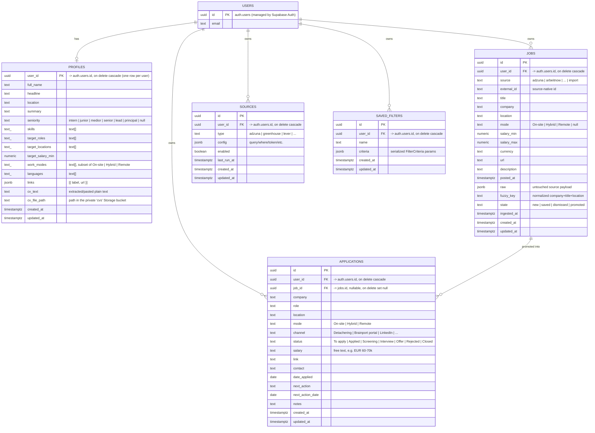

# Database

Postgres on Supabase. Five application tables, all owned by a Supabase Auth user
and protected by Row-Level Security. The source of truth is the migrations under
`supabase/migrations/` (`0001_init.sql` for the original four tables,
`0002_profiles.sql` for `profiles` + the private CV storage bucket); the
TypeScript mirror is `src/types/database.ts`. This doc explains the shape and the
*why*.

---

## ER diagram



> `USERS` is Supabase's built-in `auth.users` table — we don't define it, we only
> reference it. Every app table carries a `user_id` FK to it with
> `on delete cascade`, so deleting an account removes all of its data.

---

## Relationships & lifecycle

- **Ownership (5×):** `applications`, `jobs`, `sources`, `saved_filters`, and
  `profiles` each belong to a user via `user_id`. This is what RLS keys on.
  `profiles` is the one **1:1** table — `user_id` is its primary key, so there is
  at most one profile row per user.
- **Promotion (`jobs` → `applications`):** `applications.job_id` is a **nullable**
  FK to `jobs.id`. When you *Promote* a discovered job, a new application row is
  created with `job_id` set and the job's `state` flipped to `promoted`. Manually
  created applications have `job_id = null`. There's intentionally **no unique**
  constraint on `job_id` (you could promote the same posting twice), and the FK is
  `on delete set null` so deleting a job won't delete the application you built
  from it — it just unlinks.

---

## Tables in detail

### `jobs` — the discovery inbox

Ingested postings, normalized into one shape. Created **before** `applications`
in the migration because `applications.job_id` references it.

- **Hard dedupe:** `UNIQUE (user_id, source, external_id)`. This is the conflict
  target for the idempotent upsert in `src/lib/discovery/ingest.ts` — re-ingesting
  the same posting updates content instead of duplicating.
- **Fuzzy dedupe:** `fuzzy_key` (normalized `company + title + location`) lets the
  app collapse the same role arriving from different sources. Computed in app code,
  stored for querying.
- **`state`** (`new | saved | dismissed | promoted`, check-constrained) is the
  per-user workflow state. The upsert deliberately **omits** `state` and
  `ingested_at`, so a refresh never resets your decisions or the original sighting
  time.
- **`raw jsonb`** keeps the untouched source payload for debugging / future
  re-normalization.
- Indexes: `(user_id, state)`, `(user_id, fuzzy_key)`, `(user_id, posted_at desc)`
  — matching the inbox's tab counts, dedupe lookups, and default sort.

### `applications` — the pipeline

Your real applications. Mostly free-text for flexibility, with check constraints on
the controlled vocabularies:

- `mode ∈ {On-site, Hybrid, Remote}` (or null)
- `channel ∈ {Detachering, Brainport portal, LinkedIn, Recruiter, Direct, Referral, Other}` (or null)
- `status ∈ {To apply, Applied, Screening, Interview, Offer, Rejected, Closed}`,
  default `'To apply'`
- `salary` is **text** (e.g. "€60–70k") — human shorthand, unlike the numeric
  `jobs.salary_min/max`.
- Indexes: `(user_id, status)` for the stat counts/filter, `(user_id, next_action_date)`
  for the Needs-action queue and the next-action-first sort, `(job_id)` for the link.

### `sources` — per-user ingestion config

One row per enabled feed/board. `type` selects the fetcher; `config jsonb` holds its
parameters (Adzuna `query/where/...`, or an ATS `{ token, name }`). `enabled` gates
whether ingestion runs it; `last_run_at` is stamped after each run (manual or cron).
Index: `(user_id, enabled)`.

### `saved_filters` — discovery presets

`criteria jsonb` stores the **serialized filter params** (the output of
`criteriaToParams` in `src/lib/discovery/filter-params.ts`), so applying a preset is
just pushing those keys onto the discovery URL. Index: `(user_id)`.

### `profiles` — the owner's profile + CV (1:1)

One row per user, keyed directly by `user_id` (no separate `id`). Holds identity
(`full_name`, `headline`, `location`, `summary`), `seniority` (check-constrained
to the ladder, or null), array preferences (`skills`, `target_roles`,
`target_locations`, `languages`, and `work_modes` — the latter check-constrained
to a subset of `On-site | Hybrid | Remote`), `target_salary_min` (numeric), and
`links jsonb` (`[{ label, url }]`).

The CV lives as **plain text** in `cv_text` — populated either by pasting or by
extracting an uploaded PDF. `cv_file_path` points at the uploaded PDF in the
private `cvs` Storage bucket. The pure parsing/validation/clamping for all of
this lives in `src/lib/profile.ts`; writes go through `actions/profile.ts`. Added
in migration `0002_profiles.sql`.

---

## Row-Level Security

RLS is **enabled on all five tables**, and each has four owner-only policies
(select / insert / update / delete) of the form:

```sql
-- read
using (auth.uid() = user_id)
-- write (insert)
with check (auth.uid() = user_id)
-- update
using (auth.uid() = user_id) with check (auth.uid() = user_id)
```

Consequences worth remembering:

- The **anon/publishable key is safe in the browser** — a user can only ever touch
  rows where `user_id = auth.uid()`. This is the whole security model.
- App code never filters by `user_id` for safety reasons (RLS does it), but inserts
  must still set `user_id = auth.uid()` to satisfy the `with check`. Server actions
  do this explicitly.
- The **cron route is the one exception:** there is no session during a scheduled
  run, so it uses the **service-role** client (`src/lib/supabase/admin.ts`), which
  bypasses RLS. It is server-only and writes each job with an explicit `user_id`.
  Never expose that key to the browser.
- **Storage is RLS'd too:** the private `cvs` bucket has owner-only policies on
  `storage.objects` keyed on the first path segment
  (`(storage.foldername(name))[1] = auth.uid()::text`). App code writes to
  `"<user_id>/cv.pdf"`, so a user can only read/write their own folder. The
  bucket is **not public** — there is no anonymous URL.

---

## Triggers & defaults

- `set_updated_at()` is a trigger function attached `before update` to all four
  tables; it stamps `updated_at = now()` on every modification.
- UUIDs default to `gen_random_uuid()` (pgcrypto, enabled in the migration).
- `created_at` / `ingested_at` default to `now()`.

---

## Changing the schema

1. Add a new migration file under `supabase/migrations/` (don't edit `0001_init.sql`
   after it's been applied to a real project).
2. Mirror the change in `src/types/database.ts` — keep using **`type` aliases, not
   `interface`s** (supabase-js's table constraint requires the implicit index
   signature that object-literal types have and interfaces don't; see the note at
   the top of that file).
3. If you add a table, enable RLS and add the four owner-only policies — an
   RLS-less table is readable by anyone with the anon key.
4. Run the green gate (`npm run typecheck && npm run lint && npm test && npm run build`).
